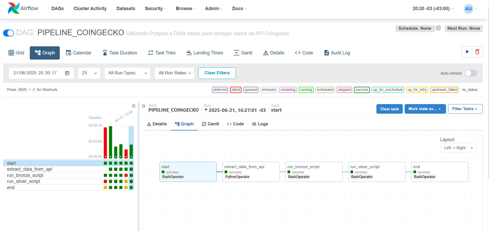

# 🔗 Projeto de Engenharia de Dados – CoinGecko Pipeline

Este projeto simula um pipeline completo de engenharia de dados, utilizando extrações da [API CoinGecko](https://www.coingecko.com/) e tecnologias como **Apache Airflow**, **PySpark** e **Delta Lake** para transformar os dados em camadas `stage`, `bronze` e `silver`, com foco em aplicações analíticas e estruturadas para consumo via Power BI.

---

## 📊 Estrutura do Projeto

```bash
📆 src/
 ├── jobs/
 │   ├── 1-stage/        # Scripts para extrair e salvar arquivos JSON (dados brutos da API)
 │   ├── 2-bronze/       # Scripts PySpark para criar tabelas Delta com histórico completo
 │   └── 3-silver/       # Scripts PySpark para gerar tabelas Delta com o dado mais recente
 └── logs/               # Tabela de logs de execução
```

---

## 🧪 Tecnologias Utilizadas

* **Airflow Standalone** (2.7.3) – agendamento e orquestração de pipelines
* **PySpark (3.4.2)** com Delta Lake (2.4.0)
* **API CoinGecko** – extração de dados de criptomoedas em tempo real
* **Delta Lake** – controle de versões e transações ACID nas camadas Bronze e Silver

---

## 🔄 Camadas do Pipeline

| Camada   | Descrição                                                                                                                                                                             |
| -------- | ------------------------------------------------------------------------------------------------------------------------------------------------------------------------------------- |
| `stage`  | Contém os arquivos JSON extraídos diretamente da API. São salvos com timestamp e armazenam os dados brutos.                                                                           |
| `bronze` | Contém tabelas Delta com o **histórico completo** de cada chamada da API. Há controle por **chaves primárias** (ex: `id`) e **hash de todas as colunas** para identificar alterações. |
| `silver` | Contém a **última versão** de cada moeda, mantendo apenas os registros mais recentes e limpos para consumo em BI.                                                                     |

---

## ⚙️ Orquestração com Airflow

O pipeline é composto por 3 tasks principais no DAG:

1. **`extract_api_data`** → Extrai os dados da CoinGecko e salva como JSON na pasta `stage/`
2. **`run_bronze_script`** → Executa script PySpark via `spark-submit` para gerar/atualizar a camada Bronze
3. **`run_silver_script`** → Executa script PySpark para atualizar a camada Silver com os dados mais recentes

### 📷 Visualização do DAG



### 🔧 Exemplo da Task `run_bronze_script`:

```python
run_bronze_script = BashOperator(
    task_id='run_bronze_script',
    bash_command='spark-submit --packages io.delta:delta-core_2.12:2.4.0 \
        --master local[*] \
        --conf "spark.sql.extensions=io.delta.sql.DeltaSparkSessionExtension" \
        --conf "spark.sql.catalog.spark_catalog=org.apache.spark.sql.delta.catalog.DeltaCatalog" \
        --conf "spark.driver.extraJavaOptions=-Dlog4j.configurationFile=src/jobs/log4j2.properties" \
        /mnt/c/Users/arcan/Documents/airflow/src/jobs/2-bronze/coingecko/coingecko.py coingecko id',
)
```

> Os argumentos são passados via `sys.argv`, permitindo scripts genéricos e reutilizáveis.

---

## 📝 Logs de Execução

O pipeline grava uma tabela Delta de logs, contendo:

* task\_id
* status (SUCESSO, ERRO)
* timestamp
* mensagem de erro (se houver)

---

## 🚀 Instruções para Executar o Projeto

### ⭐️ Subindo o Airflow Standalone (ambiente de estudo)

```bash
# 1. Criar diretório e ambiente virtual
python -m venv venv && source venv/bin/activate

# 2. Instalar Airflow
pip install "apache-airflow==2.7.3" --constraint "https://raw.githubusercontent.com/apache/airflow/constraints-2.7.3/constraints-3.9.txt"

# 3. Definir variáveis de ambiente
export AIRFLOW_HOME=~/opt/airflow
export AIRFLOW__CORE__LOAD_EXAMPLES=False

# 4. Inicializar o Airflow standalone
airflow standalone
```

---

### ⚡ Subindo o Apache Spark com Delta (ambiente local)

```bash
# 1. Instalar Java
sudo apt-get install openjdk-8-jdk-headless -qq

# 2. Instalar bibliotecas PySpark e Delta
pip install pyspark==3.4.2 delta-spark==2.4.0
```

### 🧟 SparkSession com Delta

```python
from pyspark.sql import SparkSession

spark = SparkSession.builder \
    .master("local[*]") \
    .config("spark.jars.packages", "io.delta:delta-core_2.12:2.4.0") \
    .config("spark.sql.extensions", "io.delta.sql.DeltaSparkSessionExtension") \
    .config("spark.sql.catalog.spark_catalog", "org.apache.spark.sql.delta.catalog.DeltaCatalog") \
    .getOrCreate()
```

---

### ▶️ Rodando scripts com `spark-submit`

```bash
spark-submit --packages io.delta:delta-core_2.12:2.4.0 \
--conf "spark.sql.extensions=io.delta.sql.DeltaSparkSessionExtension" \
--conf "spark.sql.catalog.spark_catalog=org.apache.spark.sql.delta.catalog.DeltaCatalog" \
--conf "spark.driver.extraJavaOptions=-Dlog4j.configurationFile=src/jobs/log4j2.properties" \
./src/jobs/2-bronze/coingecko.py coingecko id
```

---

## 📊 Consumo dos dados

Os dados da camada `silver/` e `gold/` podem ser consumidos por ferramentas de BI como o **Power BI**, apontando diretamente para os arquivos `.parquet` gerados, localmente ou em um diretório de rede.

---

## 📌 Roadmap futuro

* [ ] Criar camada `gold/` com visões analíticas (top moedas, variações, market cap)
* [ ] Publicar painel em Power BI ou Streamlit
* [ ] Versão com Delta Lake + Spark em cluster (Dataproc ou EMR)

---

## 🧑‍💻 Autor

**Yan Arcanjo**
Desenvolvedor de pipelines analíticos com foco em dados organizados e rastreáveis usando Spark, Airflow, e arquitetura medallion.

---

> *Este projeto foi desenvolvido para fins de estudo e demonstração prática de um pipeline de dados moderno, com ingestão, versionamento e transformação robusta de dados.*
